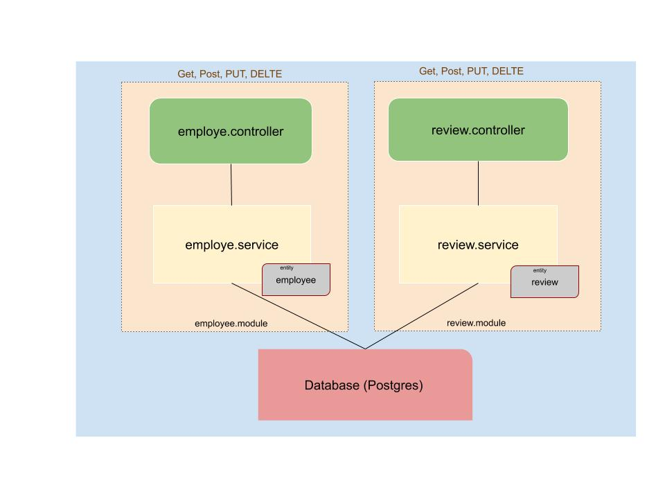

# Full Stack Developer Challenge

The original description can be found [HERE](original_description.md)

## How to run this project

- Using docker-compose

You need have docker-compose and docker installed in your Operating System. Make sure your ports `4200`, `3000`, `5432` are not bound

```
$ docker-compose up
```

- Run directly

yarn, nodejs > 10, npm are assumed in your shell. postgres are assumed in your system

```
$ cd server
$ yarn install
$ npm run start:dev
$ cd ../client
$ npm install -g @angular/cli@8.0.3
$ npm install
$ ng serve
```

Open browser acesss `http://localhost:4200` to see the application

## Design philosophy

This project is a very typical CRUD applications which contains different roles of users. each role has different but some shared operations
 need to be implemented.

I design a typical Client/Server application which the server only expose a set of HTTP RESTful API, and the client is a Single Page Application.
This structure make it more easy to develop. Since we don't need some SEO or Social share, the server side rendering is not needed.

For backend. I pick NodeJs along with NestJs to build the backend HTTP Restful API service. The choice is base on the the time limit,
 scope of complexity and the technology what I'm interested in.

NestJs is a emerging NodeJs web application framework which heavily inspired by Angular. It's the first time I tried this framework and its
 design is perfectly serve the purpose of my design. It can leverage Typescript and DI for fast application development and still have a better
 maintainable codebase.

The frontend, of course will be Angular which was my favorite frontend framework by now. Though I think in this projects any framework will be
OK and have some very similar efficiency to develop.

## Architecture



The backend is base on NestJs framework. The application organised by modules and I use the Repository Pattern to make 2 main modules for `employee`
 and `review`. This two modules has its own domain class, service layer and controller.

### Controller
The controllers expose HTTP RESTful API using the very intuitive decorator provided by NestJs. for this project,
 I have two controllers that serve the `/employee` and `/review` path. each contains basic CRUD operations.

### Service layer
The service layer handles data access between a controller and a persistent storage. For a large real world application, usually, a persistent
 compatibility layer is beneath it to handle the database operation this also called DAO. but in this application I just merge it into one layer
 to simplify the total code. If you look into the code you can find the service class extends an abstract class `BaseDtoService<T>`. this class implements an
 interface `PersistentStorage<T>` which is a simple form of repository pattern. it defines a basic CRUD operations for each repository.
 the abstract class implements some common operations and the lifecycle hooks.


### Database
At the first I use an ORM library called TypeORM which can use Typescript as a tool for Object Mapping. but then I have some trouble with the configuration
 which always fail when working with many-to-many relationship. document doesn't give any hints. TO save time I fallback to a legacy solution I've written before
 This use the driver directly with raw sql statement. This also results in the requirements of Postgres

### Client

The client is built with Angular and Angular Material. It's very simple and intuitive. The code is self-explanation.

## Assumption and Limitations

- Login/Logout is faked. It's only a lot of configuration in the NestJs and Passport. I choose not to implement them due to time limit and
 unimportant.
- Route guard are not implemented due to fake login
- API guard are not implemented due to fake login
- Password are not encrypted stored, in a real world application. the password should be properly encrypted with salt to protect user's privacy.
- No paging feature is designed at the collection APIs.